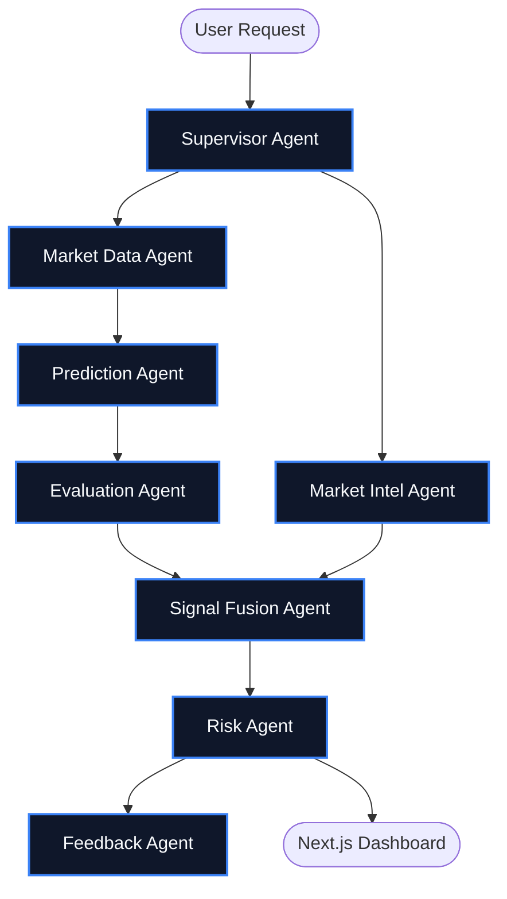

<div align="center">
  <h1>Hermes Crypto Prediction Bot 🚀</h1>
  <p>
    <strong>A production-ready, agentic AI platform for cryptocurrency price prediction and risk management.</strong>
  </p>
  
  <p>
    
    
    
    
    
  </p>
</div>

---

## 🌟 Overview

Hermes is an AI-orchestrated cryptocurrency trading prediction engine. It utilizes the [Hermes Agents Framework](https://github.com/nousresearch/hermes-agent) to orchestrate a "swarm" of highly specialized AI agents that collaborate to evaluate market opportunities. It fuses sophisticated quantitative modeling (using Foundation Models like Kronos) with real-world market intelligence, and calculates exact position sizing based on mathematically-proven risk paradigms (Kelly Criterion).

The platform is split into two robust components:
1. **Python FastAPI Backend**: Orchestrates the multi-agent AI swarm, data fetching, prediction fusion, and risk logic asynchronously.
2. **Next.js UI**: A dynamic, beautiful web dashboard displaying real-time predictions, agent status, portfolio health, and analytics.

## 🏗️ AI Swarm Architecture

The core of the system is the **Agent Swarm**. When a prediction is requested, the agents execute a unified workflow without requiring human intervention.



### The Agents

1. **👨‍💼 Supervisor Agent**: The orchestrator. Coordinates the swarm, triggers agents in the correct order, and uses an LLM to generate an executive summary rationale for the final decision.
2. **📈 Market Data Agent**: Collects historical multi-timeframe OHLCV data from exchanges.
3. **🌐 Market Intelligence Agent**: Analyzes fundamental odds from decentralized prediction markets (like Polymarket/Kalshi).
4. **🧠 Prediction Agent**: Runs technical price predictions over raw data using the Kronos Foundation model.
5. **⚖️ Evaluation Agent**: Calibrates technical predictions using Platt Scaling to correct for model overconfidence.
6. **🔗 Signal Fusion Agent**: Fuses calibrated technical probabilities with real-world fundamental consensus probabilities.
7. **🛡️ Risk Agent**: Determines optimal position sizing and expected value using the Kelly Criterion.
8. **💾 Feedback Agent**: Updates the database with execution memory to adapt to market regimes over time.

## 📂 Project Structure

```text
hermes-crypto-pilot/
├── app/                  # FastAPI Backend Logic
│   ├── agents/           # Hermes worker agents 
│   ├── api/              # FastAPI application endpoints
│   ├── config/           # Multi-profile configurations using pydantic
│   ├── domain/           # Core Pydantic schemas (market, prediction, risk)
│   ├── services/         # External API integrations
│   └── telemetry/        # Structured JSON logging
│
├── ui/                   # Next.js Frontend App
│   ├── app/              # Next.js App Router pages
│   ├── components/       # Shadcn UI reusable components
│   ├── lib/              # Utility functions and API clients
│   └── public/           # Static assets
│
└── main.py               # Main API entrypoint
```

## 🚀 Getting Started

The project comes with a built-in **Mock Mode**, allowing you to instantly run the whole system without external API keys (Binance, OpenRouter, etc.).

### 1. Start the Backend API

1. Ensure you have Python 3.11+ installed.
2. Open a terminal at the root directory and install dependencies:
   ```bash
   pip install -r requirements.txt
   ```
3. Run the FastAPI server:
   ```bash
   python main.py api
   ```
   *The API will be available at `http://localhost:8000`.*

### 2. Start the Next.js UI Dashboard

1. Open a new, separate terminal and navigate into the `ui` folder:
   ```bash
   cd ui
   ```
2. Install dependencies via `pnpm` (or `npm`/`yarn`):
   ```bash
   pnpm install
   ```
3. Run the development server:
   ```bash
   pnpm run dev
   ```
   *The UI will be available at `http://localhost:3000`.*

## ⚡ Using the App

1. Open `http://localhost:3000` in your browser.
2. Click the **"New Prediction"** button in the top right.
3. Enter a crypto ticker (e.g., `BTC` or `ETH`).
4. Click **"Run Agents"**.
5. Watch as the modal synchronously awaits the `SupervisorAgent`'s workflow. It will automatically populate the screen with the AI's calculated Direction, Confidence interval, Target Price, and Stop Loss!

## 🧪 Testing & Validation

The backend supports extensive unit testing and offline backtesting without risking capital.
To run tests:
```bash
pytest
```

## 📜 License

This project is licensed under the [MIT License](LICENSE).
